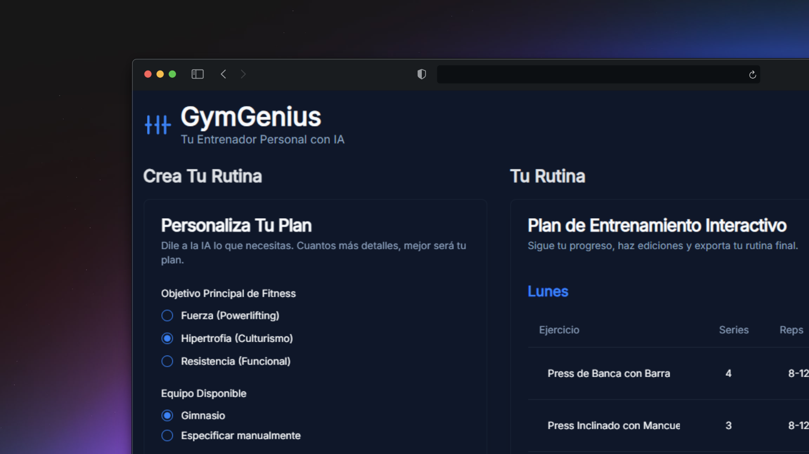

# 💪🏻 GymGenius

**GymGenius** es una aplicación web moderna desarrollada con **Next.js** y **Genkit** que genera **rutinas de entrenamiento personalizadas** utilizando la inteligencia artificial de **Google Gemini**.  
Más que una simple app de fitness, busca ser tu **entrenador personal digital**, adaptado a tus objetivos, nivel y preferencias.


## 🧠 Motivación

La idea de **GymGenius** nació del deseo de unir dos pasiones: el desarrollo web y el entrenamiento físico.  
A menudo, las personas se sienten perdidas al diseñar sus rutinas, sin saber si realmente se ajustan a sus objetivos o condición actual.  

La aplicación busca resolver ese problema mediante IA, generando rutinas **personalizadas, dinámicas y efectivas** sin necesidad de ser un experto en entrenamiento.

El objetivo final es ofrecer una herramienta que **simplifique la planificación del entrenamiento** y ayude a construir hábitos saludables de forma inteligente.


## ⚙️ Stack Tecnológico

### Core
- **[Next.js](https://nextjs.org/)** – Framework React con renderizado híbrido (SSR/SSG)
- **[Genkit](https://ai.google.dev/genkit)** – SDK de Google para integrar modelos de IA (Gemini)
- **[Node.js 18+](https://nodejs.org/)** – Entorno de ejecución
- **[npm](https://www.npmjs.com/)** – Gestor de dependencias

### Integraciones IA
- **[Gemini API](https://makersuite.google.com/app/apikey)** – Motor de generación de rutinas y planes personalizados
- **Entorno seguro (.env.local)** – Protección de claves API y datos sensibles

### Estilo y UX
- **CSS Modules / TailwindCSS** – Estilos modulares o utilitarios según preferencia
- **Diseño Responsive** – Adaptado para desktop, tablet y móvil
- **Interfaz limpia y minimalista** – Enfocada en usabilidad y simplicidad


## 🚀 Características Principales

### 🧩 Rutinas Personalizadas
- 💬 **Generación con IA (Gemini)** basada en tu objetivo, nivel y preferencias
- 🏋️‍♀️ **Ejercicios detallados** con series y repeticiones
- 🔄 **Regeneración dinámica**: pide una nueva rutina cuando lo necesites

### ⚡ Experiencia de Usuario
- 🖥️ **Interfaz intuitiva y minimalista**
- ⚙️ **Configuración rápida** mediante formularios simples
- 🔐 **Privacidad garantizada** (sin necesidad de registro ni datos personales)
- 📱 **Compatible con todos los dispositivos**

### 🧠 Inteligencia Artificial
- 💡 Usa el modelo **Gemini** de Google para interpretar tus metas
- 🧬 Aprende de tus respuestas y ajusta el enfoque de la rutina
- 🧰 Permite combinar entrenamiento de fuerza, cardio y movilidad


## 📷 Vista Previa
 



## 🔧 Instalación y Configuración

### Prerrequisitos
- **Node.js** (versión 18 o superior)  
- **npm** (instalado junto con Node.js)  
- **Clave de API de Gemini** desde [Google AI Studio](https://makersuite.google.com/app/apikey)

### Instalación
```bash
# Clonar el repositorio
git clone https://github.com/TU_USUARIO/TU_REPOSITORIO.git
cd TU_REPOSITORIO

# Instalar dependencias
npm install
```

### Configurar la API Key
Crea un archivo `.env.local` en la raíz del proyecto y añade tu clave:

```
GEMINI_API_KEY="TU_API_KEY_AQUI"
```

> 🔒 Este archivo está incluido en `.gitignore` para proteger tu clave de acceso.

### Ejecutar el servidor
```bash
npm run dev
```

Abre [http://localhost:9002](http://localhost:9002) en tu navegador para ver la aplicación.


## 🤖 Asistencia de IA

**GymGenius** fue desarrollado con apoyo de herramientas de **inteligencia artificial**, que colaboraron en:

- Generación de lógica para la conexión con Gemini  
- Creación de prompts optimizados  
- Sugerencias de estructura de componentes  
- Revisión de código y optimización  

Aun así, **todas las decisiones creativas y técnicas** fueron realizadas manualmente, combinando la IA como una herramienta de apoyo al proceso de desarrollo.


## 🔄 Flujo de Generación de Rutina

1. **Ingreso de datos del usuario**: objetivo, nivel, días disponibles, etc.  
2. **Procesamiento con Gemini**: la IA interpreta y crea una rutina adaptada.  
3. **Visualización en pantalla**: ejercicios ordenados por grupos musculares.  
4. **Regeneración**: el usuario puede solicitar una nueva versión o ajustes.  


## 🤝 Contribución

Las contribuciones son bienvenidas.  
Para colaborar:

1. Haz un **fork** del repositorio  
2. Crea una rama (`git checkout -b feature/nueva-funcionalidad`)  
3. Realiza tus cambios y haz **commit**  
4. Envía un **Pull Request**

> 🧩 Se recomienda mantener la estructura de código limpia, documentar los componentes nuevos y evitar exponer claves o datos sensibles.


## 📄 Licencia

Este proyecto está bajo la **Licencia MIT**.  
Consulta el archivo `LICENSE` para más detalles.


## ⚠️ Descargo de Responsabilidad

**GymGenius** es una herramienta con fines **educativos y de demostración tecnológica**.  
Las rutinas generadas por la aplicación son sugerencias automáticas basadas en inteligencia artificial y **no deben considerarse como asesoramiento profesional**.

Antes de comenzar cualquier plan de entrenamiento o nutrición, se recomienda **consultar con un médico, preparador físico o nutricionista calificado** para asegurarse de que las rutinas sean adecuadas para tu condición física y objetivos personales.  

El autor **no se hace responsable** por lesiones, daños o resultados derivados del uso de esta aplicación.


## 👤 Autor

Desarrollado con ❤️ por **Juan Bautista Malina**  

- 🌐 [Portfolio](https://juanbautistamalina.github.io/portfolio/)  
- 💻 [GitHub](https://github.com/juanbautistamalina)  
- 💼 [LinkedIn](https://www.linkedin.com/in/juan-bautista-malina)
